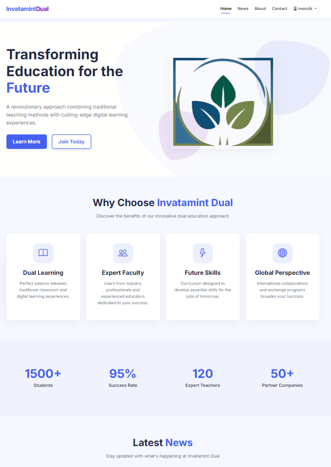
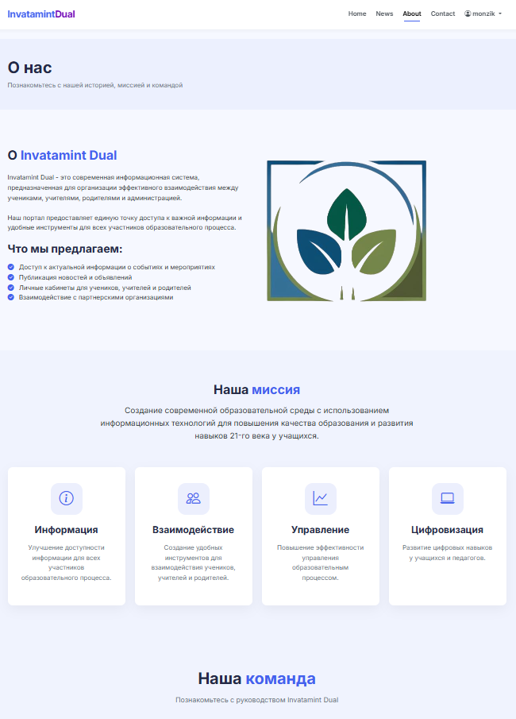
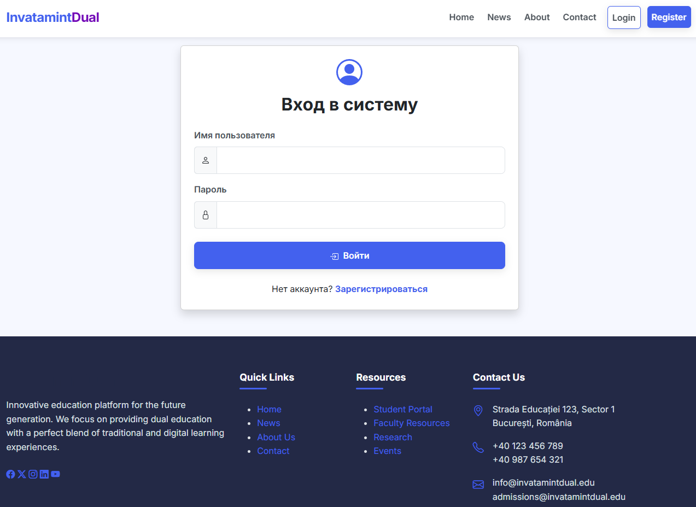

# School Portal Project

**IMPORTANT: This project is incomplete and will remain incomplete due to non-payment issues by the client. It is being shared for portfolio and reference purposes only.**

## Project Overview

A web-based school information portal designed to facilitate communication between students, teachers, parents, and school administration.

### Key Purposes:
- Simplify communication between teachers, students, and parents
- Provide secure access to educational resources and administrative tools
- Automate routine tasks like attendance tracking and grade reporting
- Create a unified digital environment for the entire school ecosystem

The system was designed to replace outdated paper-based processes and disconnected digital tools with a single, integrated platform. While the current implementation is incomplete, the foundation demonstrates the core architecture and key functionality that would enable a complete school management solution.

## Features (Partially Implemented)

- User authentication system
- Different user roles (admin, user, organization)
- News publication and viewing
- User profiles
- Organization information management
- Administrative functions
- Responsive design

## Tech Stack

### Backend (Python Flask API)
- Python 3.9+
- Flask
- SQLite database
- JWT authentication

### Frontend (Flask Templates)
- HTML/CSS
- Bootstrap 5
- Jinja2 templates
- JavaScript

## Project Structure

```
school-portal/
├── pbackend/             # Python Flask API Backend
│   ├── app.py            # Main backend application
│   ├── models.py         # Data models
│   ├── requirements.txt  # Python dependencies
│   └── school_portal.db  # SQLite database
├── pfrontend/            # Python Flask Frontend
│   ├── app.py            # Frontend application
│   ├── static/           # Static assets (CSS, JS)
│   ├── templates/        # HTML templates
│   └── requirements.txt  # Python dependencies
└── create_admin.py       # Utility to create admin users
```

## Installation Guide

### Prerequisites
- Python 3.9 or higher
- Git

### Setup Instructions

1. Clone the repository:
   ```bash
   git clone https://github.com/MONZikWasTaken/SchoolPortal.git
   cd ../SchoolPortal
   ```

2. Set up the backend:
   ```bash
   cd ../pbackend
   pip install -r requirements.txt
   ```

3. Set up the frontend:
   ```bash
   cd ../pfrontend
   pip install -r requirements.txt
   ```

4. Create an admin user (may not work, fix your self):
   ```bash
   python create_admin.py
   ```

6. Start the backend server:
   ```bash
   cd pbackend
   python app.py
   ```

7. In a separate terminal, start the frontend server:
   ```bash
   cd pfrontend
   python app.py
   ```

8. Access the application in your browser at http://localhost:5000 or http://localhost:5001

## Current Limitations

- Several features remain unimplemented or partially implemented
- The UI may contain placeholders
- Some API endpoints may return mock data
- Limited testing has been performed

## Web Preview

Here are some screenshots of the application in action:

### Home Page


*The main landing page with navigation and overview of the school portal*

### About Page


*Information about the school portal, its mission and features*

### Login Page


*The secure authentication portal for users to access the system*

## Disclaimer

This project is being shared "as-is" without warranty of any kind. Development was halted due to payment issues with the client, and the code is incomplete. Use at your own risk.
